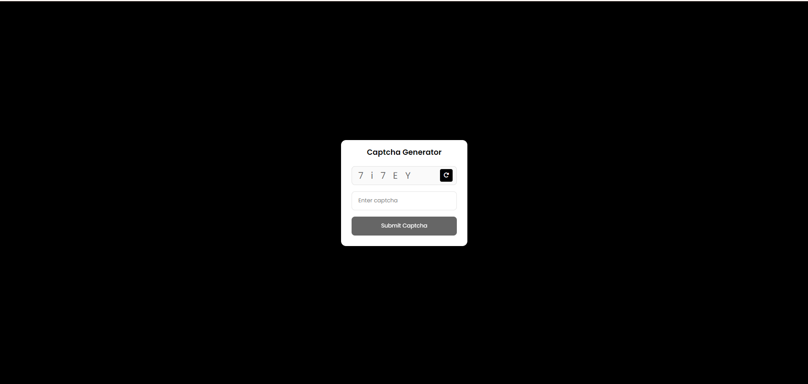

# Captcha Generator using JavaScript

A simple CAPTCHA (Completely Automated Public Turing test to tell Computers and Humans Apart) generator implemented using JavaScript. CAPTCHAs are commonly used in web forms to prevent automated bots from submitting spam or abusive content.

## Preview

## Features

- Generates random CAPTCHA images with alphanumeric characters.
- Customizable options for CAPTCHA length and complexity.
- Easy-to-use interface for generating and downloading CAPTCHA images.

## How to Use

1. Clone the repository to your local machine.
2. Open the `index.html` file in a web browser.
3. Adjust the CAPTCHA length and complexity settings as desired.
4. Click the "Generate CAPTCHA" button to create a new CAPTCHA image.
5. Use the generated image in your web forms or applications to prevent automated submissions.

## Technologies Used

- HTML, CSS, and JavaScript for the front-end interface.
- Random image generation using JavaScript.
- Customizable settings for CAPTCHA generation.

## License

This project is licensed under the [MIT License](LICENSE).
